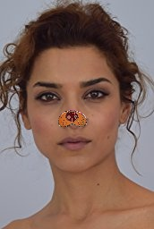

# Filterize

## Description
A simple Web aplication for applying filter to your selfie images. This web app contains 2 filter:
- Cartoonize : Filter that will return your cartoon selfie image
- Nose filter : Filter to replace your nose with animal nose (dog, cat, and pig)

## HOW TO USE

### Github
Clone the repo
```
git clone https://github.com/Clayrisee/Filterize.git
```

Build the docker image 
```
docker build -t filterize:latest .
```

Run the container
```
 docker run -d -p 5000:5000 filterize:latest 
```

visit your [localhost](https://http://localhost:5000/)

### Docker
If you want to use this images app you can visit this [link](https://hub.docker.com/repository/docker/clayrisee/filterize)

pull the image
```
 docker pull clayrisee/filterize:latest
```

run the container
```
 docker run -d -p 5000:5000 clayrisee/filterize:latest 
```

visit your [localhost](https://http://localhost:5000/)

## Example Output
Here's the example output of this application. 

| Input Image      | Output |
| ----------- | ----------- |
|      |  |
|      |  |
|      |  |
|      |  |
|      |  |


© Developed by [Clayrisee](https://github.com/Clayrisee) - Internship at Nodeflux
